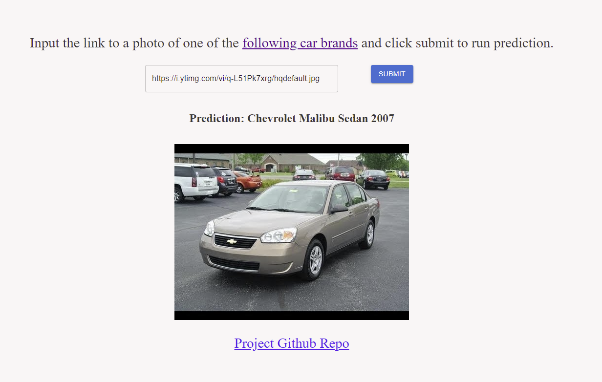

# Car Brand Classifier Using Azure ML 

The following repository contains the source code for training and deploying a machine learning web app for classifying car brands using Azure ML service.

The final web application is hosted in an Azure Container Instance here: http://car-classifier-app.westus2.azurecontainer.io:5000/.



## Prerequisites

1. Install Azure ML CLI 2.0
2. Create an Azure ML workspace
3. Modify the config.json with your own workspace properties

## To train model

1. Follow the steps in teh `prep_data.md` file.

2. Create a compute cluster through the Azure ML Studio UI. 

3. Create training environment.

```
az ml environment create -f env-train.yml
```

4. Submit the training job (modify job-single-node.yml as needed).

```
az ml job create -f job-single-node.yml
```

## To deploy the model

1. Register the model by running the `register_model.py` script.

```
python register_model.py --run_id <RUN ID>
```

2. Create inference environment.

```
az ml environment create -f env-inference.yml
```

3. Create online endpoint (modify endpoint.yml as needed).

```
az ml online-endpoint create -f endpoint.yml
```

4. Deploy the model (modify deployment.yml as needed).

```
az ml online-deployment create -f deployment.yml
```

## Run webapp

1. Make a copy of the `app/server/.env.example` file and name it `.env`. Update the API key and server url to match your deployment config.

2. Run the app and navigate to localhost:5000

```
cd app && npm start
```

Alternatively, you can build and run the app in a docker container.

```
cd app
docker build . -t <USERNAME>/car-classifier-app
docker run -e API_KEY=<API KEY> -e SERVER_URL=<SERVER URL> -p 5000:5000 -d <USERNAME>/car-classifier-app 
```